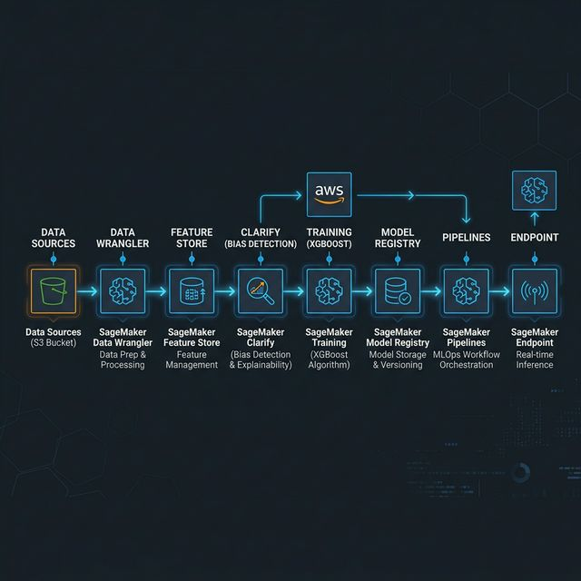
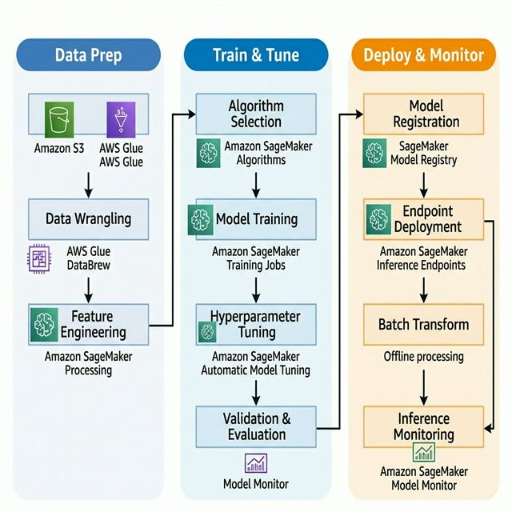

# Auto Insurance Claim Fraud Detection with AWS SageMaker

This project is an end-to-end implementation of a machine learning lifecycle designed to detect fraudulent transactions in auto insurance claims. I used Amazon SageMaker to build, train, and deploy the entire workflow.

## AWS Components Used

### SageMaker Data Wrangler
I used Data Wrangler for the initial data preparation phase. It helped me ingest the synthetic customer and claim datasets, explore the data distributions, and apply transformations like one-hot encoding which I then exported as a .flow file.

### SageMaker Feature Store
To manage and reuse features consistently, I stored the processed data in the SageMaker Feature Store. I used the Offline Store for training and the Online Store for low-latency inference, ensuring that the same feature definitions are used throughout the lifecycle.

### SageMaker Clarify
I used Clarify to identify potential bias in the training dataset and the model itself. It helped me check for things like class imbalance before training and provided SHAP-based explanations for how the model makes its predictions.

### SageMaker Pipelines
I automated the entire process by building a SageMaker Pipeline. This orchestrates the data prep, training, evaluation, and model registration into a single, repeatable workflow.

### SageMaker Model Endpoints
Finally, I deployed the trained XGBoost model to a hosted SageMaker endpoint. This allows for real-time inference, where a claim can be classified as fraud or not fraud as soon as it is submitted.

## What I Learned
Through this project, I gained a deep understanding of MLOps on AWS. I learned how to move from exploratory notebooks to an automated pipeline, how to maintain feature consistency using a Feature Store, and the importance of bias detection for building fair and reliable models.

## Project Structure
- 0-AutoClaimFraudDetection.ipynb: EDA on the raw data.
- 1-data-prep-e2e.ipynb: Preparing and storing features.
- 2-lineage-train-assess-bias-tune-registry-e2e.ipynb: Training, bias assessment, and hyperparameter tuning.
- 3-mitigate-bias-train-model2-registry-e2e.ipynb: Deploying the final model.
- pipeline-e2e.ipynb: Orchestrating the full pipeline.

## References
This project is based on the following AWS blogs:
- [Detect fraudulent transactions using machine learning with Amazon SageMaker](https://aws.amazon.com/blogs/machine-learning/detect-fraudulent-transactions-using-machine-learning-with-amazon-sagemaker/)
- [Architect and build the full machine learning lifecycle with Amazon SageMaker](https://aws.amazon.com/blogs/machine-learning/architect-and-build-the-full-machine-learning-lifecycle-with-amazon-sagemaker/)
